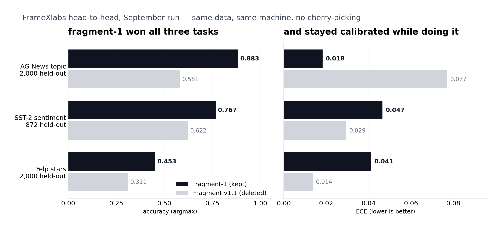

<p align="center">
  <picture>
    <source media="(prefers-color-scheme: dark)" srcset="assets/logo-dark.png" />
    
  </picture>
</p>

**A small typed-decision model. One forward pass per question, calibrated probabilities out, no text generation.**

Fragment reads a piece of text and answers typed questions about it. Three types: `choice` (pick one of N), `score` (rate on a rubric), and `noul` (yes/no with a real probability). There is no generation step, so there is nothing to parse and nothing to hallucinate. A 9M-parameter encoder, a logit at each option marker, softmax, done.

We're [FrameXlabs](https://huggingface.co/FrameXlabs) — a group of students with no GPUs. Everything in this repo was trained and measured on a 2-thread cloud vCPU that costs about nothing. Every number below comes from a run we actually did, and the scripts to redo it are in the repo.

<div align="center">

[](https://huggingface.co/FrameXlabs/fragment-1)
[](https://huggingface.co/spaces/FrameXlabs/fragment-demo)
[](LICENSE)
[](https://www.python.org)
[](https://pytorch.org)

</div>

> **What's live right now:** the model on the Hub is [`fragment-1`](https://huggingface.co/FrameXlabs/fragment-1) — that's what the badge and the quickstart use. We're also training **fragment-1 v2 from scratch** (9M params, 326k typed items, RLCD, 50-task automated roadmap) on this same CPU. v2 beat v1 on the same held-out benchmark and shipped **under the same name `fragment-1`** — v1 was replaced in place, one model stays on the account, no graveyard. The badge and the quickstart below now point at v2. <!--ROADMAP:14/50-->

<p align="center">
  
</p>

That's the head-to-head that decided which of our two models got deleted. Same data, same machine, same week. The weak one lost and is gone.

---

## The two versions

| | [`fragment-1` v1](https://huggingface.co/FrameXlabs/fragment-1) (superseded) | fragment-1 v2 (live) |
|---|---|---|
| params | 4.96M (0.98M non-embedding) | 8.98M |
| architecture | 4-layer bidirectional transformer, d=192, 4 heads | 6 pre-norm blocks, d=256, 4 heads, ff=1024 |
| vocab / context | 16,384 BPE / 160 positions | 16,384 BPE (new, from scratch) / 192 positions |
| trained on | 115k items — SST-2, AG News, Yelp-5 | 326k items — SST-2, BoolQ, AG News (options shuffled), Yelp-5, paraphrased instructions |
| training | supervised 2 epochs + 240 RLCD steps + temperature fit | supervised warmup → RLCD → calibration (roadmap task 1 of 50, in progress) |
| license | Apache 2.0 | Apache 2.0 |

## The three question types

| type | output | example question |
|---|---|---|
| `choice` | top label + probability for every option | "which topic" → World / Sports / Business / Technology |
| `score` | expected level on an ordinal rubric + full distribution | "star rating" → 1 to 5 stars |
| `noul` | a single calibrated P(true) | "is the sentiment positive" |

Why `noul` and not `bool`? Same idea, worse name. It stuck.

## Quickstart

```bash
pip install torch safetensors huggingface_hub
```

```python
from f2 import Fragment

m = Fragment.from_pretrained("FrameXlabs/fragment-1")   # v2 — same name, v1 replaced in place

res = m.decide(
    state="wall st. banks post mixed earnings as oil prices climb",
    questions={
        "topic": {
            "type": "choice",
            "instructions": "which topic",
            "criteria": {"World": "", "Sports": "", "Business": "", "Technology": ""},
        },
        "sentiment": {"type": "noul", "instructions": "is the sentiment positive"},
    },
)
print(res["answers"]["topic"]["choice"])        # -> Business
print(res["answers"]["topic"]["probabilities"]) # full distribution over the four options
print(res["answers"]["sentiment"]["noul"])      # calibrated P(positive)
```

One forward pass per question. No decoding loop, no sampling, no prompt template to memorize — the instructions and options are part of the input sequence itself.

## Try it in your browser

No Python needed: [**fragment-demo**](https://huggingface.co/spaces/FrameXlabs/fragment-demo) is a fully static Hugging Face Space. The published f16 weights (~10 MB) download into your tab, and a hand-written JavaScript port of `fragment1.py` runs every forward pass locally — no server, no GPU, nothing leaves your machine. The JS engine was tested against the Python reference on shared inputs: the probabilities match to 0.0. Four tabs: news topic + sentiment, star ratings, support triage (four questions in one pass), and a playground exposing the full `decide()` API.

## How a decision actually happens

Every question is rendered into one sequence:

```
[CLS] which topic world sports business technology Input: <your text> Options: @0 World; @1 Sports; @2 Business; @3 Technology [SEP]
```

The encoder runs once over that sequence and produces a single logit at every position. We read the logits at the `@` markers and softmax over those. That's the whole model. The input text is budgeted so the options always survive truncation, and each question type gets its own fitted temperature, which is what keeps the probabilities honest.

The weights on the Hub ship as one `model.safetensors` with the runtime (`f2.py`), `f2_config.json` and the tokenizer next to it — torch and safetensors, nothing else. The v1 runtime `fragment1.py` stays in this repo for the record.

## Measured numbers

fragment-1 **v1** (superseded by v2 under the same name), run by us, on our sandbox CPU. v2 numbers land in [`benchmarks/metrics.json`](benchmarks/metrics.json) on the sync after release evaluation. Full detail and the reproduction script: **[`benchmarks/`](benchmarks/)**

| task | data (held-out) | accuracy | ECE | Brier | RPS |
|---|---|---|---|---|---|
| `noul` | SST-2 validation, 872 | **0.767** | 0.047 | 0.320 | — |
| `choice` | AG News test, 2,000 sampled (seed 42) | **0.884** | 0.018 | 0.163 | 0.044 |
| `score` | Yelp-5 test, 2,000 sampled (seed 42) | 0.453 | 0.041 | 0.653 | 0.125 |

Calibration is the part we're proud of: mean ECE **0.035** across the three tasks, measured out of the box. Confidence gating (route on ≥0.85, escalate below) is actually usable with these numbers.

Speed, same sandbox vCPU:

| workload | latency |
|---|---|
| batched 64 at a time, idle machine | 4,872 questions in 39.2 s ≈ **8 ms / question** |
| single question, while a training job shares the CPU | ~75 ms |

## How that compares to Laya and Jev

Straight answer: it doesn't, yet. Laya and Jev are the models that inspired this project, and they're both far ahead. Their published numbers, not measured by us — we have no TypeSafe API access and didn't run Laya ourselves:

| | fragment-1 (ours, measured) | Jev 1.13 (published by TypeSafe) | Laya (published by convaiinnovations) |
|---|---|---|---|
| typed-decisions benchmark | not run | 0.727 | 0.766 |
| AG News | 0.884 | 0.910 | 0.950 |
| ECE | 0.035 | 0.246 | 0.081 (after temperature) |
| params | 4.96M | closed | 421M (ModernBERT-large) |
| hardware | 2-thread CPU | API | T4 GPU |

Those are not fair comparisons and we're not going to pretend they are. Different sizes, different hardware, different benchmark suites — their AG News numbers are on their own evaluation, ours is on the standard test split. We put the table here because we'd rather you see the gap than discover it.

## What's training right now

fragment-1 v2 shipped and replaced v1 in place; the same automated driver keeps running the 50-task roadmap's improvement rounds (see [`f2/roadmap.json`](f2/roadmap.json)): supervised warmup, RLCD rounds with proper scoring rules, per-type calibration, evaluation, release, then ~30 more improvement rounds — more epochs, IMDB and Amazon data, oversampling the weak tasks, RLCD sharpening. Each round only promotes a checkpoint if it wins on held-out data; nothing ships by vibes.

The release rule was simple: v2 had to beat v1 on the same benchmark, then ship **under the same name `FrameXlabs/fragment-1`** with v1 replaced in place. That's what happened — the name `fragment-1` now points at v2, the strongest version.

Current roadmap progress: **task 14/50** (updates on every sync).

## Training pipeline

Everything is plain Python + PyTorch, CPU-first:

```
f2/prepare_data.py     typed items from SST-2 / BoolQ / AG News / Yelp-5
f2/build_tokenizer.py  from-scratch BPE, atomic @option markers
f2/encode_data.py      compact numpy cache
f2/train_supervised.py cross-entropy on the gold marker, bf16 autocast
f2/train_rlcd.py       RLCD: GRPO-style logit-noise exploration, proper scoring rules
f2/calibrate.py        per-question-type temperature fitting
f2/evaluate.py         held-out benchmark: accuracy / ECE / Brier / RPS
f2/improve.py          one improvement round, promote only if better
f2/drive.py            roadmap driver — runs the 50 tasks with lock + heartbeat
f2/release_hf.py       Hub release + cleanup (one model remains)
benchmarks/            reproduce the numbers above
fragment1.py           the runtime for the released model
```

## Honest limits

We'd rather over-explain the weaknesses than let you find them the hard way.

* **English only.** Training data is English. Other languages are untested and will probably disappoint everyone involved.
* **It's tiny.** 8.98M parameters. Laya is 421M and it shows. Don't expect Laya-level `choice` accuracy on hard label sets.
* **`score` is the weak task.** 0.453 on Yelp stars. Ordinal rubric questions are where the model struggles most; the v2 roadmap explicitly targets them.
* **It's domain-limited.** It learned from movie reviews, news topics and restaurant ratings. A billing email, a support ticket, a code review? Out of distribution — we tested a refund-detection question and got a confident shrug. Fine-tune it (`f2/` has the whole pipeline) or don't use it there.
* **Held-out, not zero-shot.** Our benchmark numbers are on splits the model never trained on, but they're the same distributions it trained on. That's a much weaker claim than zero-shot generalization, and we label it that way on purpose.
* **Not run on the official typed-decisions benchmark.** The 0.727/0.766 numbers Jev and Laya report are on a specific benchmark suite we haven't run. When v2 is ready we'll run it and post real numbers, whatever they turn out to be.
* **CPU numbers.** All latencies are from a 2-thread cloud vCPU. On a GPU everything here would be faster; we just don't have one to measure on.
* **RLCD on a tiny model is honest but modest.** We use proper scoring rules as reward, same idea as Laya's training. It helps calibration; it does not conjure capability out of 5M parameters.

## About the logo

The wordmark says "Probability" because that's the one thing the model actually outputs. The name of the project is Fragment. We liked the tension.

## About us

[FrameXlabs](https://huggingface.co/FrameXlabs) — a group of students who want to build something big and are starting with something small that works. Issues and PRs are open; if you break it, tell us how.

## License

Apache 2.0 — code, weights, everything. See [LICENSE](LICENSE).
